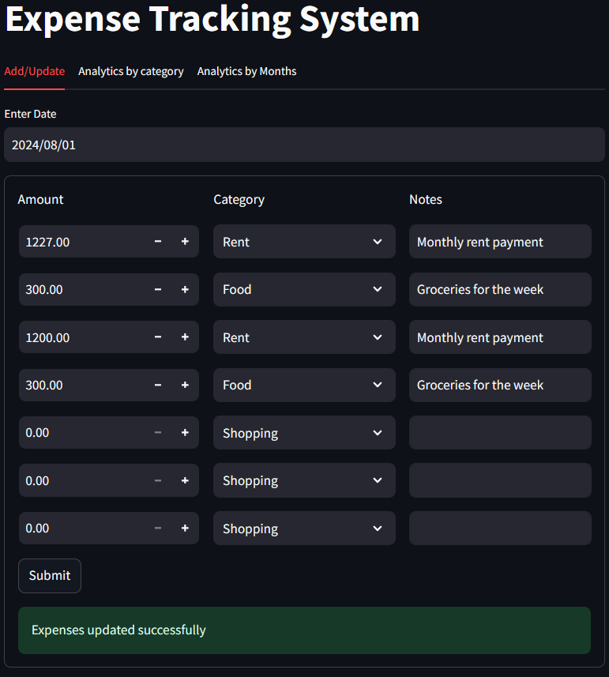
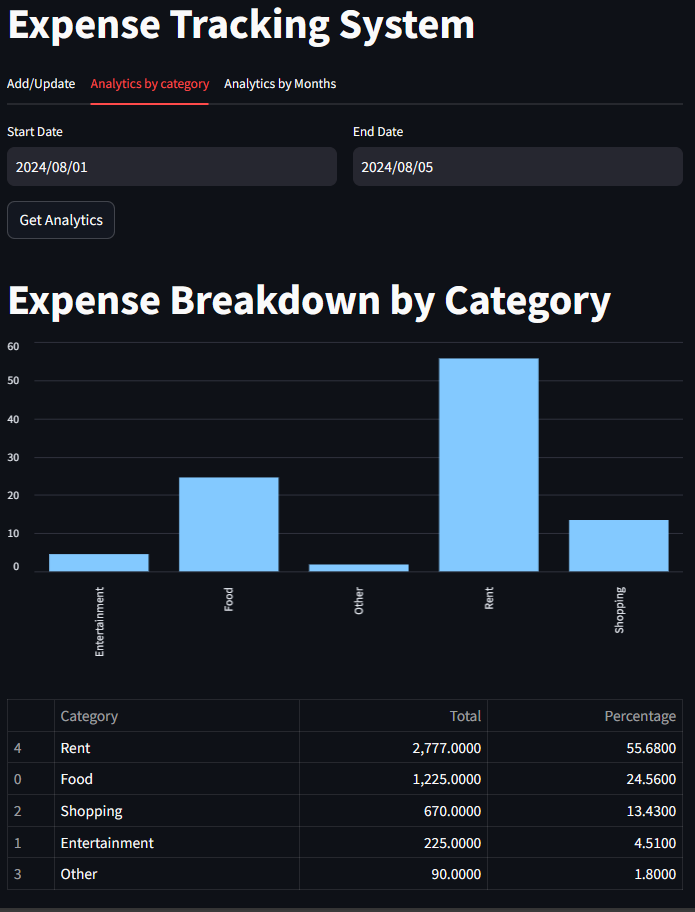
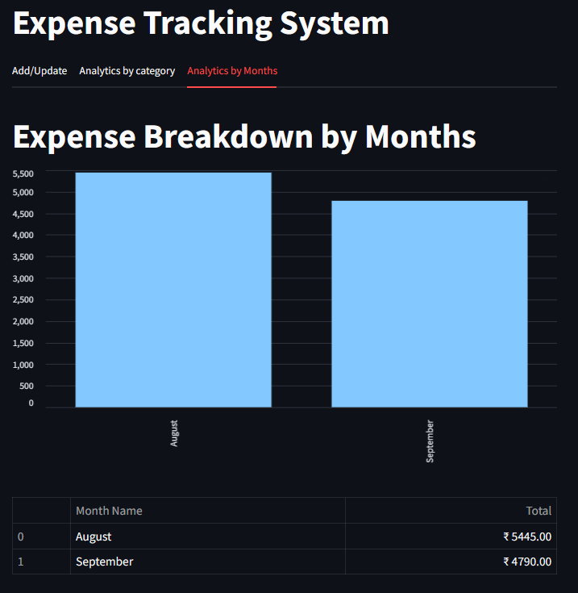

# Expense Tracking System

A full-stack application for tracking expenses with MySQL database, FastAPI backend, and Streamlit frontend.

### Tech Stack

| Layer       | Technology     | Description                                 |
|------------|----------------|---------------------------------------------|
| Database   | MySQL          | Stores expense records                      |
| Backend    | FastAPI        | Provides REST APIs for expense management   |
| Frontend   | Streamlit      | Interactive UI to log and visualize expenses|
| Validation | Pydantic       | Validates incoming request payloads         |
| Logging    | Python Logging | Tracks API transactions and debug info      |

### Project Structure  
<pre>expense-tracking-system/
├── backend/
│ ├── db_helper.py                  # Database operations
│ ├── logging_setup.py              # Logging configuration
│ ├── server.log                    # Log file
│ └── server.py                     # FastAPI server
├── frontend/
│ ├── add_update.py                 # Add/update expenses UI
│ ├── analytics_by_category.py      # Category analytics UI
│ ├── analytics_by_months.py        # Monthly analytics UI
│ └── app.py                        # Main Streamlit app
├── tests/
│ ├── backend/
│ ├── frontend/
│ └── conftest.py                   # Test configuration
├── README.md # This file
└── requirements.txt                # Dependencies </pre>

### API Endpoints  

- `GET /expenses/{expense_date}` - Get expenses for a specific date  
- `POST /expenses/{expense_date}` - Add or update expenses for a date  
- `POST /analytics/` - Get expense analytics by category for a date range  
- `GET /analytics/monthly/` - Get monthly expense summaries  

### Key Learnings

- 🔌 **Database Connectivity**: Learned to connect MySQL with Python using `mysql.connector` and context managers for safe DB access.
- ⚙️ **FastAPI**: Built APIs for CRUD operations and analytics with clear structure and validations.
- 🎯 **Pydantic Models**: Enforced strong request typing and data integrity using Pydantic.
- 🔍 **Logging**: Implemented file-based logging for transaction tracing and error monitoring.
- 📊 **Streamlit**: Built a modular and interactive front-end with separate components for adding/updating expenses (`add_update.py`), category-based analytics (`analytics_by_category.py`), and monthly insights (`analytics_by_months.py`), all integrated through the main app interface (`app.py`).

- 📦 **Modularization**: Achieved clean separation of concerns via `db_helper.py`, `server.py`, and `logging_setup.py`.

### 🖼️ UI Screenshots

#### 🔧 Add/Update Expenses  

#### 📊 Category-wise Analytics  

#### 📆 Monthly Analytics  

### Install Dependencies

<pre> pip install -r requirements.txt </pre>

### Start FastAPI Server
<pre> uvicorn backend.server:app --reload </pre>

### Access Frontend
<pre> streamlit run frontend/app.py </pre>

